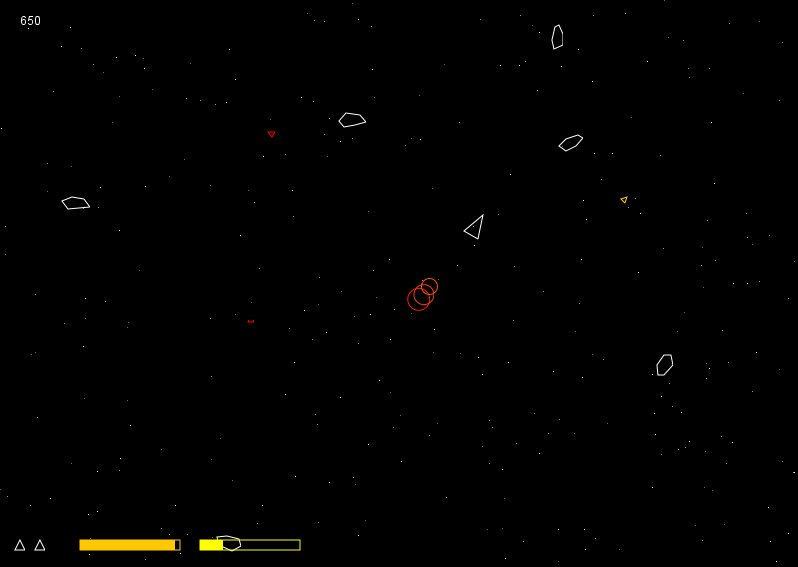

# jasteroid

A simple Asteroids clone written in Java.

## Why?

Java was one of my first programming language I learned. To test what I learned, I programmed this little game a few years ago (2009). I found the source code of the game on my hard drive.

## What does it look like?

   
